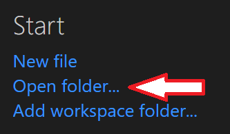
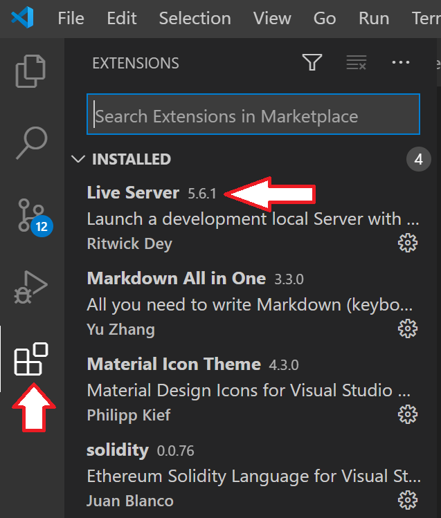

# Boring.Finance
Boring.Finance is a decentralized DeFi dashboard and management platform with the following features:

- It's fully decentralized, so it does not use a central server to store or serve any data except the static files. You can run it from anywhere.
- It uses Web3 and solidity helper contracts to get all data needed.
- Does *NOT* rely on price feeds, such as CoinGecko. Instead uses Sushiswap or Uniswap pools to find all needed exchange rates.

## How to setup development
There is no build step as the files are used and served as is. Simply serving the root directory and all files as http website will work. You can use any text editor and web server, but here's how to do it with Visual Studio Code:

Download and install [Visual Studio Code](https://code.visualstudio.com/).

[Clone](https://docs.github.com/en/free-pro-team@latest/github/creating-cloning-and-archiving-repositories/cloning-a-repository) the git repository:

    git clone https://github.com/bartjman/BoringFinance.git

Open the root directory of the project in Visual Studio Code

Install the [Live Server Extension](https://marketplace.visualstudio.com/items?itemName=ritwickdey.LiveServer)

Right-click on index.html and select 'Open with Live Server'

This will open Boring.Finance in your browser and automatically refresh on changes.

